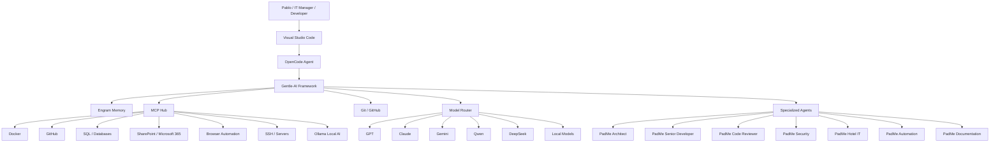

# PadMe-AI-Workstation
Building the ultimate AI-powered engineering workstation for software development, IT management, cybersecurity, automation, and knowledge engineering.

> Building an AI-native engineering environment for the next decade.

---

## Vision

PadMe AI Workstation is not another collection of AI tools.

It is a complete engineering ecosystem designed to augment software development, IT operations, cybersecurity, automation, and technical decision-making through specialized AI agents.

Instead of relying on a single model, PadMe orchestrates multiple AI systems, each performing the tasks they are best suited for.

The objective is simple:

> **Use the best intelligence for every problem.**

---

## Core Principles

- AI-first engineering
- Multi-model orchestration
- Persistent memory
- Reproducible environments
- Infrastructure as code
- Automation over repetition
- Knowledge preservation
- Continuous evolution

---

## Architecture

  👨‍💻 Arquitecto

  👨‍💻 Senior Developer

  🔍 Code Reviewer

  🔐 CyberSecurity

  🏨 Hotel IT

  ☁ SharePoint Expert

  🤖 Automation

  📊 Data Analyst

  📚 Documentation

Luego

## Components

- Visual Studio Code
- OpenCode
- Gentle-AI
- Engram
- MCP
- Docker
- Git
- Ollama
- OpenRouter
- GPT
- Claude
- Gemini

Después

## Planned AI Agents

- Architect
- Senior Developer
- Code Reviewer
- Security Engineer
- DevOps Engineer
- Hotel IT Specialist
- SharePoint Expert
- Automation Engineer
- Documentation Assistant

Después

## Roadmap

Phase 1
- Foundations

Phase 2
- Multi-model orchestration

Phase 3
- MCP ecosystem

Phase 4
- Specialized agents

Phase 5
- Automation platform

Phase 6
- Local AI infrastructure

Phase 7
- Knowledge platform

Y terminaría con una frase.

> "The workstation should become smarter every day, not simply receive updates."
