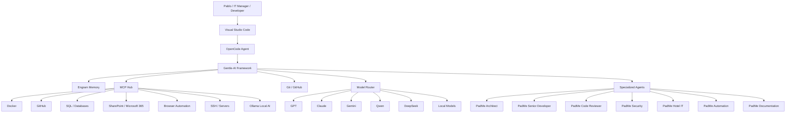

# PadMe AI Workstation

> Reference implementation of the PadMe Engineering Platform.

PadMe AI Workstation is an AI-native engineering environment designed for software development, IT management, cybersecurity, automation, and knowledge engineering.

It is not just a collection of tools. It is the first implementation of a broader platform built around specialized agents, persistent memory, multi-model orchestration, reproducible configuration, and automation.

---

## Version

**Version:** 0.1.0  
**Codename:** Genesis  
**Status:** Foundation design

---

## Vision

PadMe exists to create an engineering environment where humans and artificial intelligence collaborate naturally, preserve knowledge, automate repetitive work, and continuously improve the quality of software, infrastructure, and technical decisions.

The workstation is the local implementation. The platform is the long-term architecture.

---

## Architecture



---

## Core Principles

- **Human First**: AI assists, but humans remain accountable for critical decisions.
- **Best Tool for Every Task**: no single model or tool is assumed to be ideal for everything.
- **Everything as Code**: configurations, prompts, agents, scripts, and decisions are versioned.
- **Memory over Context**: important knowledge should persist beyond a single chat or session.
- **Reproducibility**: the environment should be rebuildable from documentation and scripts.
- **Vendor Independence**: the platform must avoid depending on a single AI provider.
- **Automation by Default**: repeated manual work should become automated workflows.

---

## Initial Roadmap

### Phase 0 — Genesis

Define the vision, principles, scope, repository structure, and architectural decision process.

### Phase 1 — Developer Workstation

Install and document the local engineering environment: Visual Studio Code, Git, Docker, OpenCode, Gentle-AI, Engram, and Ollama.

### Phase 2 — Model Orchestration

Design the multi-model strategy: GPT, Claude, Gemini, Qwen, DeepSeek, local models, and provider routing.

### Phase 3 — MCP Ecosystem

Integrate external tools and services through MCP: GitHub, Docker, databases, browser automation, Microsoft 365, SSH, and local AI.

### Phase 4 — Agent Platform

Create specialized PadMe agents for architecture, development, review, security, hotel IT, automation, and documentation.

### Phase 5 — Automation

Convert repeated technical workflows into scripts, playbooks, and agent-assisted procedures.

---

## Repository Structure

```text
PadMe-AI-Workstation/
├── docs/
│   ├── 00-foundation/
│   ├── 01-architecture/
│   ├── 02-components/
│   ├── 03-models/
│   ├── 04-agents/
│   ├── 05-mcp/
│   ├── 06-memory/
│   ├── 07-security/
│   ├── 08-playbooks/
│   └── 09-decisions/
├── configs/
├── agents/
├── prompts/
├── knowledge/
├── scripts/
├── mcp/
├── templates/
├── examples/
└── assets/
```

---

## Motto

> Design once. Learn forever. Automate everything.
