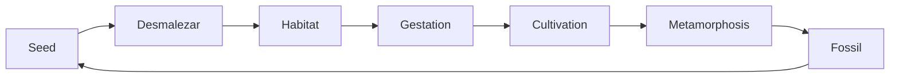

# PadMe Dashboard

> First visible window into the PadMe universe.

This dashboard gives quick access to the foundational structure, current status, operating mechanism, and first systems of PadMe AI Workstation.

---

## Current Bloom

| Field | Value |
| --- | --- |
| Platform | PadMe Engineering Platform |
| Reference implementation | PadMe AI Workstation |
| Version | 0.1.0 |
| Codename | Genesis |
| Current stage | First Sprout |
| Main artifact | `canon.yaml` |
| Source of truth | Repository |

---

## Foundational Documents

| Area | Document | Purpose |
| --- | --- | --- |
| Vision | [Vision](./Vision.md) | Why PadMe exists. |
| Principles | [Principles](./Principles.md) | The rules that guide the garden. |
| Roadmap | [Roadmap](./Roadmap.md) | Current phases and direction. |
| Visual Roadmap | [Visual Roadmap](./Visual-Roadmap.md) | Graphical phase overview. |
| Architecture | [Platform Architecture](../01-architecture/Platform-Architecture.md) | Technical architecture baseline. |
| Canon | [`canon.yaml`](../../canon.yaml) | First structured representation of PadMe. |

---

## Decisions

| ADR | Decision | Status |
| --- | --- | --- |
| [ADR-0001](../09-decisions/ADR-0001-padme-as-engineering-platform.md) | PadMe as an Engineering Platform | Accepted |
| [ADR-0002](../09-decisions/ADR-0002-knowledge-first-architecture.md) | Knowledge-First Architecture | Accepted |
| [ADR-0003](../09-decisions/ADR-0003-capability-driven-design.md) | Capability-Driven Design | Accepted |

---

## Operating Cycle

---

## System Visibility

| System | Purpose | Stage | Visibility |
| --- | --- | --- | --- |
| Canon System | Preserve structured truth. | Seed | ███░░░░░░░ |
| Decision System | Preserve ADRs and RFCs. | Growing | █████░░░░░ |
| Evolution System | Preserve transformations and fossils. | Seed | ██░░░░░░░░ |
| Knowledge System | Cultivate durable knowledge. | Seed | ██░░░░░░░░ |
| Workstation System | Build the local engineering environment. | Next | █░░░░░░░░░ |
| Agent System | Define companions and agents. | Future | ░░░░░░░░░░ |
| Model System | Route capabilities to AI models. | Future | ░░░░░░░░░░ |
| Integration System | Connect tools and environments. | Future | ░░░░░░░░░░ |
| Automation System | Convert repeated work into workflows. | Future | ░░░░░░░░░░ |

---

## Genesis Progress

| Track | Progress |
| --- | --- |
| Vision | ████████░░ |
| Principles | ████████░░ |
| Architecture | ██████░░░░ |
| Canon | ████░░░░░░ |
| Dashboard | ███░░░░░░░ |
| Workstation Setup | █░░░░░░░░░ |
| Agents | ░░░░░░░░░░ |
| Automation | ░░░░░░░░░░ |

---

## Immediate Next Steps

1. Keep `canon.yaml` as the current operational map.
2. Define the first technical dashboard source data.
3. Create the Workstation System setup checklist.
4. Validate local environment: Git, VS Code, PowerShell, Docker.
5. Decide whether the first dynamic dashboard will be generated by script, static HTML, or PadMe CLI.

---

## Compass Questions

Before adding a new tool, system, or process, ask:

- What are we really trying to cultivate?
- Are we revealing a path or forcing one?
- Does this help the garden evolve without losing its identity?
- Is this a tool, a capability, a system, or a domain?
- Does this belong in an ADR, RFC, journal, or canonical YAML?

---

## Dashboard Direction

This Markdown dashboard is temporary.

The long-term direction is to make the dashboard data-driven, reading from canonical structured sources such as:

- `canon.yaml`
- future `systems.yaml`
- future `domains.yaml`
- future `journey.yaml`
- future evolution snapshots

Eventually, this may become part of PadMe Studio.
