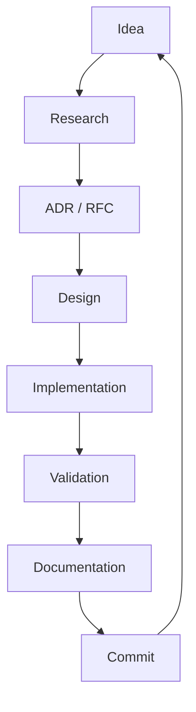

# Visual Roadmap

This roadmap shows where PadMe AI Workstation is today and how the platform is expected to evolve.

## Current position

**Current version:** 0.1.0  
**Codename:** Genesis  
**Current phase:** Phase 0 — Genesis

```mermaid
flowchart LR

    P0[Phase 0<br/>Genesis<br/>Foundation Design]:::active
    P1[Phase 1<br/>Developer Workstation]:::next
    P2[Phase 2<br/>Model Orchestration]:::future
    P3[Phase 3<br/>MCP Ecosystem]:::future
    P4[Phase 4<br/>Agent Platform]:::future
    P5[Phase 5<br/>Automation]:::future
    P6[Phase 6<br/>Local AI]:::future
    P7[Phase 7<br/>Knowledge Platform]:::future

    P0 --> P1 --> P2 --> P3 --> P4 --> P5 --> P6 --> P7

    classDef active fill:#d4f8d4,stroke:#2e7d32,stroke-width:2px,color:#111;
    classDef next fill:#fff3cd,stroke:#b7791f,stroke-width:2px,color:#111;
    classDef future fill:#eeeeee,stroke:#777,stroke-width:1px,color:#111;
```

## Phase detail

| Phase | Name | Purpose | Status |
| --- | --- | --- | --- |
| 0 | Genesis | Define vision, principles, architecture, ADRs, and repository structure. | Active |
| 1 | Developer Workstation | Build the reproducible local engineering environment. | Next |
| 2 | Model Orchestration | Define model routing, profiles, providers, and local/cloud strategy. | Planned |
| 3 | MCP Ecosystem | Connect PadMe to external systems and tools. | Planned |
| 4 | Agent Platform | Create specialized PadMe agents. | Planned |
| 5 | Automation | Convert repeated work into workflows, scripts, and playbooks. | Planned |
| 6 | Local AI | Add resilient offline/local model capabilities. | Planned |
| 7 | Knowledge Platform | Grow the knowledge system into the long-term PadMe garden. | Planned |

## Working rhythm

## Roadmap rules

- The repository is the source of truth.
- Roadmap changes should be documented.
- Major direction changes require an ADR or RFC.
- A phase is not complete until its documentation and validation steps are complete.
